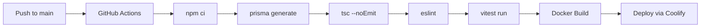

```text

      ╔══════════════════╗   ╔══════════════════════════╗
      ║   ╔══════════╗   ║   ║                          ║
      ║   ║  CABIN   ║   ║   ║        T R A I L E R    ║
      ║   ╚══════════╝   ║   ║                          ║
      ╚══════════════════╝   ╚══════════════════════════╝
       ██╔══╗  ██╔══╗         ██╔══╗  ██╔══╗  ██╔══╗
       ██║  ║  ██║  ║         ██║  ║  ██║  ║  ██║  ║
       ╚═╝  ╚═╝  ╚═╝         ╚═╝  ╚═╝  ╚═╝  ╚═╝  ╚═╝

```

<p align="center">
  <a href="https://www.caracarriers.com"></a>
  
  
  
  
  
  
  
  
  
</p>

---

## Overview

**CaraCarriers** is a modern, full-featured Transportation Management System (TMS) built for freight brokers. It streamlines the entire load lifecycle — from quoting and dispatching to invoicing and compliance — all in one place.

> Built by freight brokers, for freight brokers.

---

## Features

### Load Management
- Full load lifecycle: Available → Booked → Dispatched → In Transit → Delivered
- Real-time status tracking with check calls and location updates
- Rate confirmation documents and PDF generation
- Load board for finding available freight

### Carrier & Shipper Management
- Comprehensive carrier profiles with MC/DOT numbers, insurance tracking, authority status
- Shipper management with credit limits and payment terms
- Equipment type matching and carrier search

### Dispatching
- Centralized dispatch board with status filtering
- Carrier assignment and rate negotiation
- Real-time activity logs and check call tracking

### Invoicing & Finance
- Automatic invoice generation on delivery
- Invoice lifecycle: Draft → Sent → Paid → Overdue
- Integration with **Stripe** for payment processing
- Carrier payment tracking

### Document Management
- Upload and organize documents (BOL, POD, contracts, insurance certs, W-9s)
- E-signature integration with **Documenso**
- Document status tracking and compliance monitoring

### Compliance
- Insurance expiration monitoring and alerts
- Authority status tracking (active, inactive, suspended)
- Safety rating and carrier scorecards

### Additional Features
- Role-based access control (Admin, Dispatcher, Agent, Accounting, Read-Only)
- Multi-tenant architecture (per-company data isolation)
- Public freight quote form with lead capture
- Demo data seeding for evaluation
- Security-focused: CSP headers, RLS policies, honeypot protection

---

## Tech Stack

| Layer | Technology |
|-------|-----------|
| **Framework** | Next.js 16 (App Router, Server Actions) |
| **UI Library** | React 19, Radix UI Primitives |
| **Styling** | Tailwind CSS v4, Class Variance Authority |
| **Language** | TypeScript 5 (strict mode) |
| **Database** | PostgreSQL 16 via Prisma 7 ORM |
| **Auth** | Supabase Auth (SSR cookie-based sessions) |
| **Payments** | Stripe (webhooks, payment intents) |
| **Email** | Resend (transactional emails) |
| **E-Signatures** | Documenso API |
| **PDF** | pdf-lib (server-side) |
| **Logging** | Pino structured logging |
| **State** | Zustand (client state) |
| **Forms** | React Hook Form + Zod 4 validation |
| **Testing** | Vitest + Testing Library + Playwright |
| **CI/CD** | GitHub Actions + Docker + Coolify |

---

## Getting Started

### Prerequisites

- **Node.js** 22+
- **npm** 10+
- **PostgreSQL** 16 (or Supabase project)
- **Docker** (optional, for containerized deployment)

### Local Development

```bash
# 1. Clone the repository
git clone https://github.com/softwareprosdev/ccarriers.git
cd ccarriers

# 2. Install dependencies
npm install

# 3. Copy environment variables
cp .env.example .env.local

# 4. Edit .env.local with your credentials:
#    - Supabase project URL + anon key
#    - Database connection strings
#    - Resend API key (email)
#    - Documenso API token (e-signatures)
#    - Stripe keys (payments)

# 5. Generate Prisma client and run migrations
npx prisma generate
npx prisma db push

# 6. Start the development server
npm run dev
```

Open [http://localhost:3000](http://localhost:3000) in your browser.

### Available Scripts

| Script | Purpose |
|--------|---------|
| `npm run dev` | Start development server |
| `npm run build` | Production build |
| `npm start` | Start production server |
| `npm run lint` | Run ESLint |
| `npx tsc --noEmit` | Type check without emitting |
| `npx vitest run` | Run unit tests |
| `npx prisma generate` | Regenerate Prisma client |
| `npx prisma db push` | Push schema to database |
| `npx prisma studio` | Open Prisma database browser |

### Demo Data

Log in and navigate to **Settings → Demo Data** to seed the database with sample carriers, shippers, loads, and invoices for evaluation.

---

## Docker Deployment

```bash
# Build the image
docker build -t ccarriers .

# Run the container (with your .env file)
docker run -p 3000:3000 --env-file .env.local ccarriers
```

The app uses Next.js standalone output for minimal production images. See `Dockerfile` for the multi-stage build configuration.

---

## Project Structure

```
├── app/                    # Next.js App Router (pages + API + actions)
│   ├── (auth)/             # Login, Signup, Forgot Password
│   ├── actions/            # Server Actions (loads, carriers, invoices, etc.)
│   ├── api/                # API routes (health, leads, webhooks)
│   ├── dashboard/          # Main dashboard
│   ├── loads/              # Load management
│   ├── carriers/           # Carrier management
│   ├── shippers/           # Shipper management
│   ├── dispatch/           # Dispatch board
│   ├── invoicing/          # Invoice management
│   ├── documents/          # Document management
│   ├── compliance/         # Compliance tracking
│   └── settings/           # Company settings
├── components/             # React components
│   ├── ui/                 # UI primitives (shadcn-style)
│   ├── auth/               # Auth forms
│   ├── layout/             # Header, Sidebar
│   └── loads/              # Load detail components
├── lib/                    # Utilities
│   ├── supabase/           # Supabase clients
│   ├── pdf/                # PDF generation
│   └── email/              # Email sending
├── prisma/                 # Schema + migrations
├── supabase/               # SQL migrations (RLS, triggers)
├── public/                 # Static assets
└── Dockerfile              # Multi-stage build
```

---

## CI/CD

Every push to `main` triggers:



---

## Security

- **Content Security Policy** — strict CSP headers on all routes
- **HSTS** — HTTPS enforced (63072000s preload)
- **Honeypot Middleware** — blocks common attack paths (XML-RPC, .git, .env, etc.)
- **Row Level Security** — all database tables enforce company-scoped access
- **Multi-tenant** — complete data isolation between companies
- **Environment Validation** — Zod-schema validated on startup
- **Dependency Audits** — regular `npm audit` with overrides for known CVEs

---

## Contributing

We'd love your help making CaraCarriers better!

### How to Contribute

1. **Fork the repository**
2. **Create a feature branch** (`git checkout -b feature/amazing-feature`)
3. **Make your changes**
4. **Run the checks** — ensure `npx tsc --noEmit`, `npm run lint`, and `npx vitest run` all pass
5. **Commit** (`git commit -m 'Add amazing feature'`)
6. **Push** (`git push origin feature/amazing-feature`)
7. **Open a Pull Request**

### Ways to Contribute

- 🐛 **Report bugs** — Open an issue with clear reproduction steps
- 💡 **Suggest features** — Have an idea? We want to hear it
- 🔧 **Fix issues** — Check open issues for things to work on
- 📖 **Improve docs** — Better documentation helps everyone
- 🌐 **Integrations** — Add new carrier APIs, rate APIs, or payment providers

### Get in Touch

Have questions or want to discuss an idea before building?

- **Open an Issue** — [github.com/softwareprosdev/ccarriers/issues](https://github.com/softwareprosdev/ccarriers/issues)
- **Start a Discussion** — [github.com/softwareprosdev/ccarriers/discussions](https://github.com/softwareprosdev/ccarriers/discussions)
- **Email the team** — dev@caracarriers.com

We review all pull requests and welcome contributors of all skill levels. Don't hesitate to open a draft PR early for feedback!

---

## License

[MIT](LICENSE) &copy; 2026 CaraCarriers

---

<p align="center">
  <strong>Built with ❤️ for the freight industry</strong>
  <br>
  <sub>
    <a href="https://www.caracarriers.com">Website</a> ·
    <a href="https://github.com/softwareprosdev/ccarriers">GitHub</a>
  </sub>
</p>
